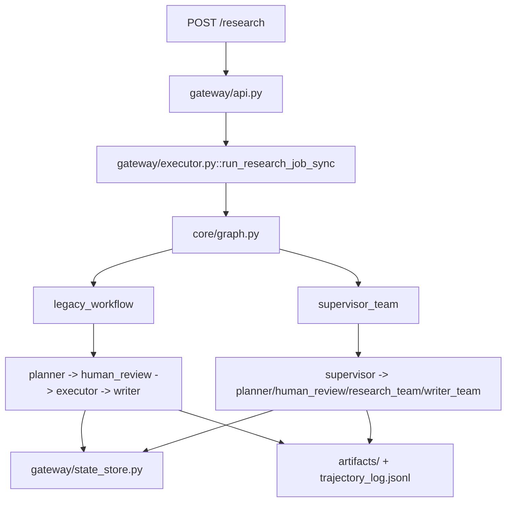

# Codebase Structure Map

Last updated: 2026-03-19

This document is for implementers. It is not a product overview. Read this first before changing the research graph, runtime contracts, or benchmark flow.

## 1. Fast mental model

There are **two research architectures** in the repo:

| Mode | Purpose | Entry graph | Key property |
| --- | --- | --- | --- |
| `legacy_workflow` | Baseline and rollback path | [`core/graph.py`](/D:/workplace/Projects/deepresearch-agent/core/graph.py) -> `legacy_app` | Code-first research and gate semantics |
| `supervisor_team` | Stage-2 experimental path | [`core/graph.py`](/D:/workplace/Projects/deepresearch-agent/core/graph.py) -> `app` | Supervisor-guided routing, retrieval planning, semantic verification |

The system is now intentionally hybrid:
- **Code owns execution, safety, persistence, provider access, and minimum gates**
- **Agents own strategy, source prioritization, and semantic sufficiency judgments**

## 2. Top-level flow

## 2.1 Validation policy

Do **not** run full smoke A/B after every change.

Use a tiered policy instead:

| Level | When to use | Command | Goal |
| --- | --- | --- | --- |
| Targeted tests | Default for local changes | `pytest <affected tests>` | Fast safety check |
| Quick smoke A/B | Changes touching graph/runtime/writer/research-team boundaries | `python scripts/public_benchmark_deepresearch_bench.py --run-smoke-ab --smoke-profile quick --judge-model qwen3:8b` | Single frozen-sample sanity check |
| Full smoke A/B | Large architecture changes, merge/sign-off, benchmark-facing refactors | `python scripts/public_benchmark_deepresearch_bench.py --run-smoke-ab --smoke-profile full --judge-model qwen3:8b` | Frozen 3-sample regression comparison |

Current smoke profiles:
- `quick`
  - frozen sample IDs: `[90]`
  - shorter default timeout
- `full`
  - frozen sample IDs: `[37, 90, 22]`
  - full architecture regression path

Rule of thumb:
- If the change does **not** alter graph routing, runtime contracts, retrieval planning, or writer termination semantics, do not pay the cost of full smoke.
- If the change **does** alter those boundaries, run `quick` first and only escalate to `full` when the quick lane is clean or when you are preparing a larger checkpoint/merge.

## 3. What each major module owns

### [`core/graph.py`](/D:/workplace/Projects/deepresearch-agent/core/graph.py)
This file should stay as the **graph wiring layer**.

Owns:
- `ResearchState`
- thin node adapters
- router functions
- `legacy_workflow` and `supervisor_team` graph assembly
- `legacy_app` and `app`

Should not own:
- retrieval/fetch implementation details
- semantic evidence verification details
- writer outcome resolution logic
- long provider/backfill loops

Current node adapters:
- `node_init_search`
- `node_human_feedback`
- `node_deep_research` -> delegates to `run_research_team(...)`
- `node_writer` -> delegates to `run_writer_team(...)`
- `node_supervisor` -> delegates to `run_supervisor(...)`

### [`core/research_supervisor_runtime.py`](/D:/workplace/Projects/deepresearch-agent/core/research_supervisor_runtime.py)
Owns **supervisor decision logic**.

Key responsibilities:
- build fallback supervisor decisions
- call `llm_smart` for structured `SupervisorDecision`
- normalize and guard supervisor output
- translate high-level decisions into next graph hop

Important truth source:
- `SupervisorDecision.next_phase` is the only phase decision source from the supervisor layer

### [`core/research_team_runtime.py`](/D:/workplace/Projects/deepresearch-agent/core/research_team_runtime.py)
Owns the **research team runtime**.

Key responsibilities:
- build `RetrievalPlan`
- run staged recall / targeted backfill orchestration
- construct `EvidenceDigest`
- run semantic verifier
- assemble `ResearchTeamResult`
- persist `evidence_bundle.json`

This is the main bridge between:
- agent-level research reasoning
- code-level retrieval/fetch execution

### [`core/writer_graph.py`](/D:/workplace/Projects/deepresearch-agent/core/writer_graph.py)
Owns the **writer subgraph**.

Current writer roles:
- `skeleton_generator`
- `section_writer`
- `editor`
- `draft_audit`
- `report_verifier`
- `revision`

Important note:
- `chart_scout` is no longer on the default route
- chart need is folded into the writer path instead of staying a standalone default hop

### [`core/writer_team_runtime.py`](/D:/workplace/Projects/deepresearch-agent/core/writer_team_runtime.py)
Owns **writer-team result normalization and terminal routing**.

Key responsibilities:
- run writer subgraph
- build `WriterTeamResult`
- persist `draft_report.json`
- resolve `DONE / RESEARCH / REPLAN / FAIL_HARD`
- enforce degraded-output semantics

### [`core/multi_agent_runtime.py`](/D:/workplace/Projects/deepresearch-agent/core/multi_agent_runtime.py)
Owns **shared contracts and truth-source helpers**.

Key contracts:
- `SupervisorDecision`
- `RetrievalPlan`
- `EvidenceDigest`

Key truth-source helpers:
- `build_task_ledger(...)`
- `build_progress_ledger(...)`
- `update_progress_ledger(...)`
- `build_slot_statuses(...)`
- `build_clause_statuses(...)`
- `compute_completion_policy(...)`
- artifact helpers (`save_json_artifact`, `load_json_artifact`)

This file is the best place for:
- schema normalization
- shared status aggregation
- artifact reference helpers

### [`core/evidence_acquisition/`](/D:/workplace/Projects/deepresearch-agent/core/evidence_acquisition)
Owns the **code execution layer for evidence acquisition**.

Files:
- [`retrieval.py`](/D:/workplace/Projects/deepresearch-agent/core/evidence_acquisition/retrieval.py)
- [`qualification.py`](/D:/workplace/Projects/deepresearch-agent/core/evidence_acquisition/qualification.py)
- [`fetch_pipeline.py`](/D:/workplace/Projects/deepresearch-agent/core/evidence_acquisition/fetch_pipeline.py)
- [`evidence_gate.py`](/D:/workplace/Projects/deepresearch-agent/core/evidence_acquisition/evidence_gate.py)

Responsibilities:
- provider calls
- search result qualification
- fetch / fallback / blocked handling
- strict evidence gate minimum checks

### [`gateway/`](/D:/workplace/Projects/deepresearch-agent/gateway)
Owns the **outer system shell**.

Important files:
- [`api.py`](/D:/workplace/Projects/deepresearch-agent/gateway/api.py)
  - FastAPI entrypoints
  - request validation
  - queue vs local fallback
- [`executor.py`](/D:/workplace/Projects/deepresearch-agent/gateway/executor.py)
  - runs `legacy_app` or `app`
  - task timeout/node budget/cost budget
  - snapshot persistence
  - final task status
- [`state_store.py`](/D:/workplace/Projects/deepresearch-agent/gateway/state_store.py)
  - SQLite task state
  - cache
  - outbox metadata
  - checkpoint/task bookkeeping
- [`outbox.py`](/D:/workplace/Projects/deepresearch-agent/gateway/outbox.py)
  - queue publishing durability

## 4. Contracts that matter

### `ResearchState`
Graph-wide mutable state.

Important fields:
- `query`
- `research_mode`
- `architecture_mode`
- `task_contract`
- `task_ledger`
- `progress_ledger`
- `research_team_result`
- `writer_team_result`
- `retrieval_plan`
- `evidence_digest`
- `team_route_trace`
- `current_phase`
- `supervisor_next_node`
- `bundle_ref`
- `draft_ref`

### `SupervisorDecision`
Produced by the supervisor layer.

Fields:
- `next_phase`
- `reason`
- `decision_basis`
- `replan_strategy`

Interpretation:
- `next_phase` decides routing
- `decision_basis` explains why
- `replan_strategy` explains how the next research strategy should shift

### `RetrievalPlan`
Produced by the scout layer, consumed by code runtime.

Fields:
- `target_clauses`
- `source_type_priority`
- `query_intents`
- `backfill_mode`
- `authority_requirement`
- `stop_after_slots`

This is the required bridge from:
- agent recommendation
to
- actual retrieval execution

### `EvidenceDigest`
Produced from stored evidence, not from full raw bundle injection.

Fields:
- `slot_statuses`
- `clause_statuses`
- `open_gaps`
- `authority_summary`
- `coverage_summary`
- `supporting_evidence_refs`
- `direct_answer_support_snapshot`

Important boundary:
- verifier agents consume the digest
- full evidence stays in artifacts via `bundle_ref`

### `ResearchTeamResult`
Main output of research runtime.

Key fields:
- `status`
- `slot_statuses`
- `clause_statuses`
- `coverage_summary`
- `open_gaps`
- `bundle_ref`
- `recommended_next_step`
- `team_confidence`
- `verifier_decision`

### `WriterTeamResult`
Main output of writer runtime.

Key fields:
- `draft_ref`
- `direct_answer`
- `coverage_report`
- `citation_support_report`
- `constraint_satisfaction`
- `analysis_gap`
- `needs_research_backfill`
- `output_mode`
- `unresolved_gaps_summary`

## 5. Data flow vs control flow

### Control flow
Control flow should stay lightweight.

Controller objects:
- `task_ledger`
- `progress_ledger`
- `SupervisorDecision`
- `ResearchTeamResult`
- `WriterTeamResult`

The supervisor should look at these, not at full evidence正文.

### Data flow
Heavy data should stay in artifact storage.

Main artifacts:
- `bundle_ref` -> evidence bundle artifact
- `draft_ref` -> draft/report artifact

Rule:
- supervisor routes by metadata
- teams pull heavy evidence through refs when needed

## 6. Code gate vs agent gate

### Code-owned bottom line
Code continues to own:
- source tier definitions
- provider/fetch/qualification
- blocked handling
- strict evidence gate minimum thresholds
- timeout / budget / checkpoint boundaries

### Agent-owned judgment
Agents now own:
- what to prioritize this round
- which source types to chase first
- whether evidence is semantically sufficient
- whether writing should backfill, degrade, or finish

Short version:
- code answers: "Did it formally pass?"
- agents answer: "Is it actually enough?"

## 7. Authority policy split

### Code layer
Code defines:
- what counts as `high_authority`
- what counts as `weak`
- what is blocked from the primary evidence set

### Agent layer
Agent decides:
- what to prioritize for this query
- whether to push `authority_first`
- whether to narrow scope or targeted-backfill a specific clause

That means:
- **code defines authority tiers**
- **agent decides current authority pursuit strategy**

## 8. Smoke A/B boundaries

The benchmark A/B must keep these two paths isolated:

### `legacy_workflow`
- code-first routing
- no supervisor semantic routing
- baseline for rollback and fairness comparison

### `supervisor_team`
- `SupervisorDecision`
- `RetrievalPlan`
- `EvidenceDigest`
- semantic verifier
- writer-side verifier budget

Do not accidentally let:
- supervisor-only semantics leak into legacy
- legacy shortcuts suppress supervisor behavior

## 9. Current technical debt

### Resolved in this phase
- `core/graph.py` is no longer a 2k+ line mixed runtime blob
- research and writer behavior now live mostly in dedicated runtime modules
- default writer path no longer routes through a standalone chart scout node

### Still worth watching
- `core/research_team_runtime.py` is now the new dense hotspot
- `core/writer_graph.py` still has a multi-step editor/revision path; keep watching graph depth
- legacy vs supervisor behavior can still drift if shared helpers gain supervisor assumptions
- smoke A/B remains the main guard against invisible architectural regressions

## 10. Where new logic should go

Use this table before editing:

| Change type | Put it in |
| --- | --- |
| New graph hop or edge | [`core/graph.py`](/D:/workplace/Projects/deepresearch-agent/core/graph.py) |
| New supervisor strategy rule | [`core/research_supervisor_runtime.py`](/D:/workplace/Projects/deepresearch-agent/core/research_supervisor_runtime.py) |
| New retrieval planning or semantic verifier logic | [`core/research_team_runtime.py`](/D:/workplace/Projects/deepresearch-agent/core/research_team_runtime.py) |
| New source qualification/fetch rule | [`core/evidence_acquisition/`](/D:/workplace/Projects/deepresearch-agent/core/evidence_acquisition) |
| New writer result normalization or degrade policy | [`core/writer_team_runtime.py`](/D:/workplace/Projects/deepresearch-agent/core/writer_team_runtime.py) |
| Shared contract / ledger / artifact helper | [`core/multi_agent_runtime.py`](/D:/workplace/Projects/deepresearch-agent/core/multi_agent_runtime.py) |
| Task persistence / cache / checkpoint metadata | [`gateway/state_store.py`](/D:/workplace/Projects/deepresearch-agent/gateway/state_store.py) |
| Queue / task execution shell | [`gateway/executor.py`](/D:/workplace/Projects/deepresearch-agent/gateway/executor.py) |

## 11. What should not go back into `graph.py`

Do not put these back into the graph file:
- provider-specific fetch logic
- backfill loop bodies
- semantic verifier prompts
- writer outcome resolution details
- artifact assembly and serialization
- long retry loops

If a node body grows into the real business implementation, move it out.

## 12. Quick navigation checklist

If you only have two minutes:
1. Read [`core/graph.py`](/D:/workplace/Projects/deepresearch-agent/core/graph.py) for routing shape
2. Read [`core/multi_agent_runtime.py`](/D:/workplace/Projects/deepresearch-agent/core/multi_agent_runtime.py) for truth-source contracts
3. Read [`core/research_team_runtime.py`](/D:/workplace/Projects/deepresearch-agent/core/research_team_runtime.py) for research behavior
4. Read [`core/writer_team_runtime.py`](/D:/workplace/Projects/deepresearch-agent/core/writer_team_runtime.py) for writer terminal logic
5. Read [`gateway/executor.py`](/D:/workplace/Projects/deepresearch-agent/gateway/executor.py) for budgets, snapshots, and final task status
